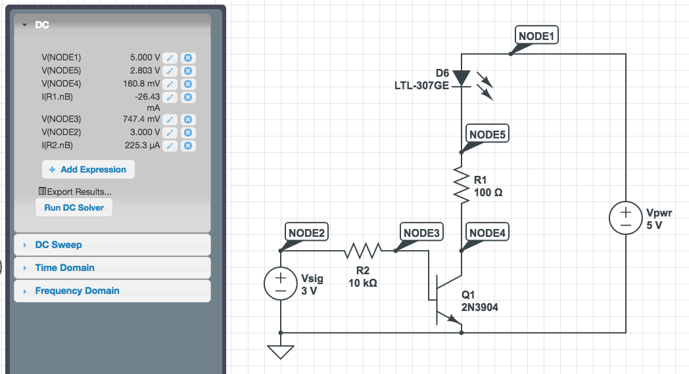

# IRBridge
Arduino IR transceiver - use extra remote control buttons to control another device

See [preview of look and feel](https://rawgit.com/neilisaac/IRBridge/master/remote.html)

### Circuit

